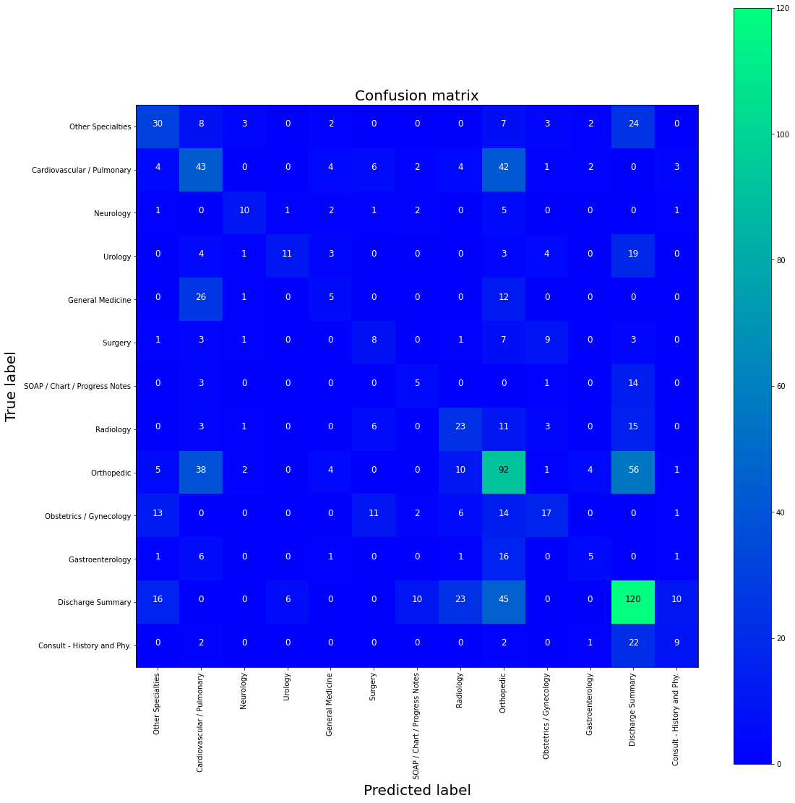

# Classifying Medical Notes
------------------------------------------------------------------------------------------
## Project Objective

Can we build a model to classify the are of medicine to which a medical note belongs to?

## Context

Doctors dictate medical notes following a visit with a patient and these notes are then attached to the patient's chart. Private practices are already specialized but patients who are hospitalized can be visited by doctors of many specialties. The idea behind this project is to get a feel for medical and see if current NLP methods are capable of distinguishing classes that often have overlap between them.

## Criteria for Success

High accuracy and precision metric for classification.

## Contraints

Medical texts are difficult to procure due to HIPAA privacy regulations, therefore it is a relatively new field in NLP. The medical lexicon is vastly different then everyday speech where most of the research for NLP has been. To make things more complicated several specialties have a lot in common in addition to all specialties sharing a core list of terms that could otherwise distinguish it from none medical text. If we were to visualize the clusters the data would overlap quite a bit.

## Data Sources

This dataset was made availble on kaggle.com
https://www.kaggle.com/tboyle10/medicaltranscriptions

## Data Exploration
There are multiple tokenizers that can be used to explore and preprocess the data after cleaning the text (explained in the next section). The RegexTokenizer and ToktokTokenizer from the nltk library were used to visualize text lengths and to see which way is better for out prediction model.
The RegexTokenizer came up with 2420937 words total, with a vocabulary size of 28581, and max sentence length of 3114.
The ToktokTokenizer came up with 1957566 words total, with a vocabulary size of 23069, and max sentence length of 2347 and completed much faster.

Cleaning this type of text is difficult because of measurment terms and the numbers that proceed them. In addition to numerical followed by measurements some of the text contained ordered lists with multiple sentences. After inspecting the words with a simple bag of words model showed that all the documents still shared words such as 'patient' or 'history' and thus most words that would be unique to the differenct classes would likely have small frequencies and we would have to be careful not to drop them.

## Preprocessing methods

THe text was cleaned using in the following manner:
<ul>
    <li>lemmatizing text</li>
    <li>removing stopwords</li>
    <li>removed special characters</li>
    <li>normalize text</li>
</ul>
After cleaning the text three preprocessing steps were considered for model selection:
<ul>
    <li>Bag of Words</li>
    <li>TF-IDF</li>
    <li>Word2Vec</li>
</ul>

## Algorithms and Machine Learning

I chose to work with scikit learn and keras deep learning models for training my classifiers.Three different proprocessing methods (BOW, TF-IDF, and Word2Vec) were tested on with logistic regression, and with keras Tokenizer with a Sequential model utilizing the 'relu' activation with one or two layers.

## Future Improvments
From the experiments it is evident that the processing method has the most impact on the model performance. As research in natural language processing move forward and application in medicine become more prevlant perhaps there will be better trained models and preprocessing methods. One such method is to apply the BioSent2Vec which containes medical text associations. The outcome of the model accuracy, precision, recall, and f1 score indicate that all the models may be overfitting, perhaps due to class imbalances. Using oversampling and undersampling methods such as SMOTE might help to overcome that.
