# Classifying Medical Notes
------------------------------------------------------------------------------------------
## Project Objective

Can we build a model to classify the are of medicine to which a medical note belongs to?

## Context

Doctors dictate medical notes following a visit with a patient and these notes are then attached to the patient's chart. Private practices are already specialized but patients who are hospitalized can be visited by doctors of many specialties. The idea behind this project is to get a feel for medical and see if current NLP methods are capable of distinguishing classes that often have overlap between them.

Medical texts are difficult to procure due to HIPAA privacy regulations, therefore it is a relatively new field in NLP. The medical lexicon is vastly different then everyday speech where most of the research for NLP has been. To make things more complicated several specialties have a lot in common in addition to all specialties sharing a core list of terms that could otherwise distinguish it from none medical text. If we were to visualize the clusters the data would overlap quite a bit.

## Data Sources

This dataset was made availble on kaggle.com
https://www.kaggle.com/tboyle10/medicaltranscriptions

## Data Exploration

[EDA Notebook](https://github.com/srtandon/Classifying_Medical_Notes/blob/main/Medical%20Texts%20-%20EDA.ipynb)

There are multiple tokenizers that can be used to explore and preprocess the data after cleaning the text (explained in the next section). The RegexTokenizer and ToktokTokenizer from the nltk library were used to visualize text lengths and to see which way is better for out prediction model.
The RegexTokenizer came up with 2420937 words total, with a vocabulary size of 28581, and max sentence length of 3114.
The ToktokTokenizer came up with 1957566 words total, with a vocabulary size of 23069, and max sentence length of 2347 and completed much faster.

##### Histogram of text lengths

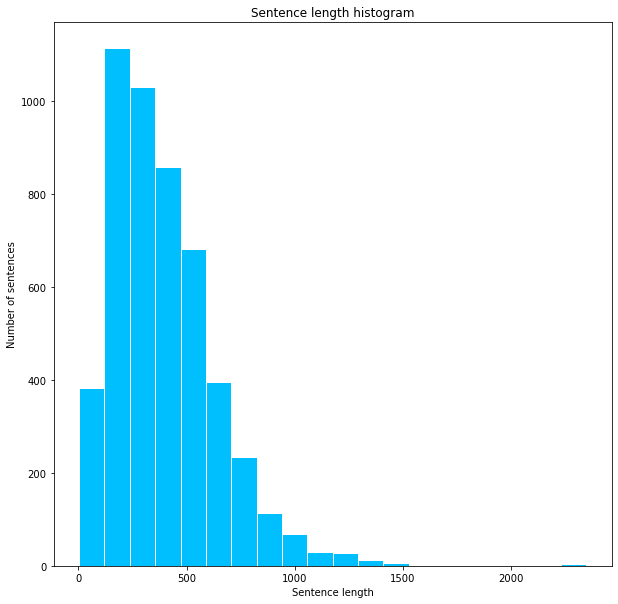

##### Word Frequency
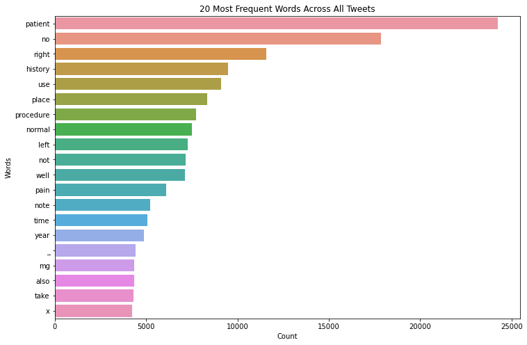

##### Bigram Frequency
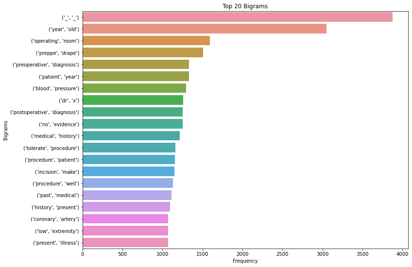

Cleaning this type of text is difficult because of measurment terms and the numbers that proceed them. In addition to numerical followed by measurements some of the text contained ordered lists with multiple sentences. After inspecting the words with a simple bag of words model showed that all the documents still shared words such as 'patient' or 'history' and thus most words that would be unique to the differenct classes would likely have small frequencies and we would have to be careful not to drop them. Ignoring the most frequent bigram containing "\_" the most frequent combination of words is 'year old' which makes sense given the age plays a huge role in which specialties the patient is visiting or gets visited by. The next two most frequent bigrams are terminology related to surgery which is the specialty with the most samples, we can see that naturally the highest frequency are associated with the area of medicine with the most samples in the dataset. 

## Preprocessing methods

THe text was cleaned using in the following manner:
<ul>
    <li>lemmatizing text</li>
    <li>removing stopwords</li>
    <li>removed special characters</li>
    <li>normalize text</li>
</ul>
After cleaning the text three preprocessing steps were considered for model selection:
<ul>
    <li>Bag of Words</li>
    <li>TF-IDF</li>
    <li>Word2Vec</li>
</ul>

[Preprocessing Notebook](https://github.com/srtandon/Classifying_Medical_Notes/blob/main/Medical%20Texts%20-%20EDA.ipynb)

## Algorithms and Machine Learning

[LogReg Modeling examples](https://github.com/srtandon/Classifying_Medical_Notes/blob/main/Medical%20Texts%20-%20Modeling.ipynb)

I chose to work with scikit learn and keras deep learning models for training my classifiers. Three different proprocessing methods (BOW, TF-IDF, and Word2Vec) were tested with logistic regression, and with keras Tokenizer with a Sequential model utilizing the 'relu' activation with one or two layers.

#### BOW vs TF-IDF

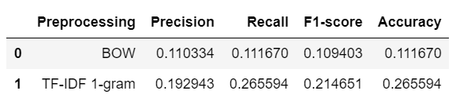

#### Selecting the best Model

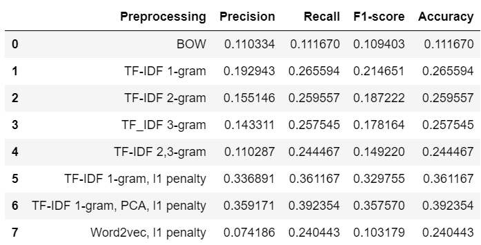

##### Confusion Matrix of Best Model
The true label is on the vertical axis and the predicted label is on the horizontal axis.
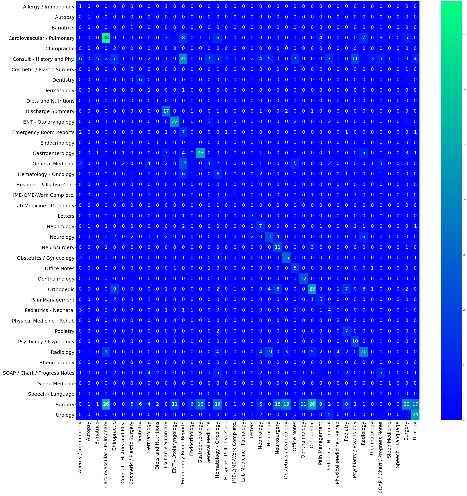

#### Modeling after Class Adjustment

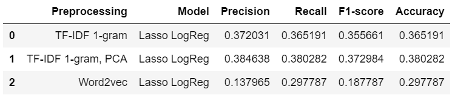

#### Selecting the best model with SMOTE (an oversampling method)

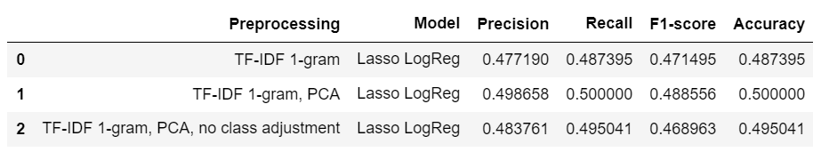

##### Confusion Matrix of Best Model after Class Adjustment
The true label is on the vertical axis and the predicted label is on the horizontal axis.
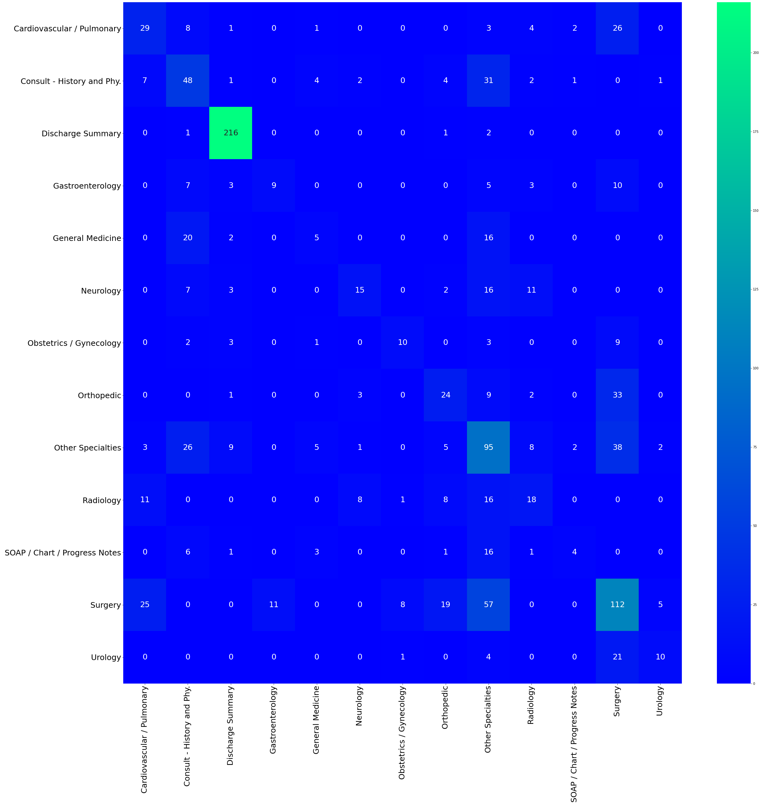

##### Confusion Matrix of Best Model without Class Adjustments

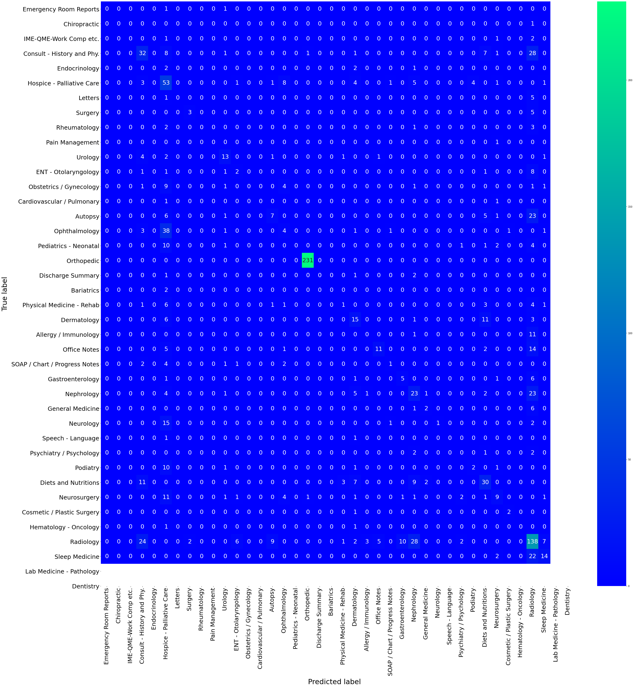

## Conclusion
[Deep Learning Models](https://github.com/srtandon/Classifying_Medical_Notes/blob/main/Medical%20Texts%20-%20DeepLearningModels.ipynb)

In experimenting with deep learning models the best accuracy achieved was 36% which was better than other models before optimization but equivalent to the best model before introducing oversampling. The deep learning models showed significant validation loss with higher training accuracies indicating that the models were overfitting. After a few hours messing around with simple RNN and LSTM models, logistic regression was selected as the best model for further optimization. An accuracy of 50% was achieved with SMOTE oversampling and model optimization, a remarked improvement over the initial accuracy shown in the BOW vs TF-IDF table. Having used logistic regression with PCA before a choice was made to use a dimensional reducer to see if the accuracy improved, the experiment proved successful and was chosen as a preprocessing method for the model pipeline. Once the final model was trained and assessed with a test set, new, never-before-seen samples, were tested on the LogisticRegression model which failed to correctly predict the class. It is no mystery why the model guessed the class with most examples, statistically its bound to be right.

##### Results of sample text
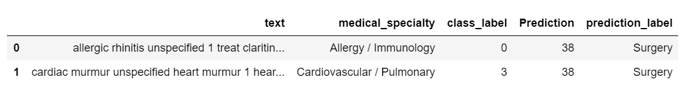

## Future Improvments

From the experiments it is evident that the preprocessing method has the most impact on the model performance. As research in natural language processing move forward and application in medicine become more prevalent perhaps there will be better trained models and preprocessing methods. Methods such as BioSent2Vec which contains medical text associations, or SentenceTransformers in pytorch could help improve the accuracy but given the overlap between medical specialties it will be difficult. As you can see from the image of the best model the SMOTE method dropped two of the classes during sampling, a framework like SMOTE is not transparent so it is not clear why the classes disappeared. Future experimentation could involve manually using the class_weight parameter which accepts dictionaries or assigned weights for each class.
